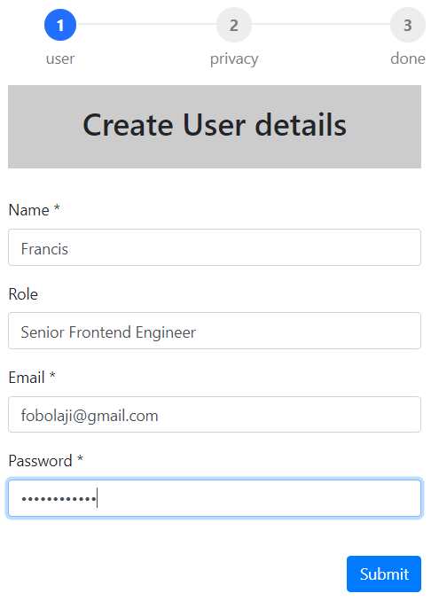
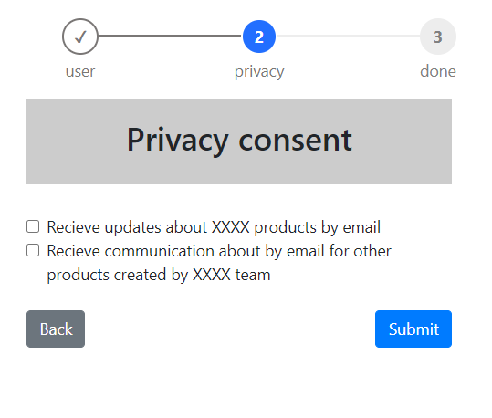
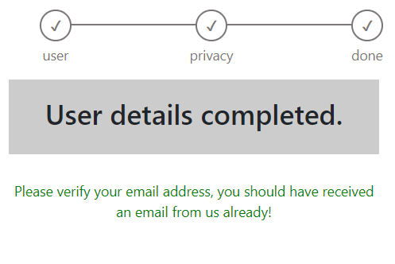

## Create User App 
This is a simple web-app to collect user details by filling a form in three steps.

## Technical Note:
### Used: 
 * Yarn
 * Create react-app
 * Redux, 
 * Thunk, 
 * cocurrently, j
 * json-server, 
 * axios, 
 * useForm, 
 * react-bootstrap and 
 * react-router-dom.
 
 *For tests:*
 * jest,
 * enzyme,
 * redux-mock-store
 * fetchmock,
 * test-library
 
React Hooks api (functional component) is used to simplify the project, and it was structured for clarity by code splitting into component, shared component, store/api and though the structure can be improved 
and tidy up. 
 
The `application` consist of 3 pages and each page must be completed and the steps at the top of the pages will indicate 
the progress stages of the application.

1. the first page has a form to collect 
   * user 
   * name, 
   * role, 
   * email
   * password.
  - There is a form validation to ensure that all required fields are filled with user inputs.
  - if form is not valid, it will not proceed to the next step/page.
 
2. the second page is to choose or consent and signup to product marketing notifications. 
    - Thare two checkboxes to tickand they are not mandatory.
    - no input validation on these input fields.
    - at this stage, the user details of both pages should be ready to be created under user profile.
3. the last page will which is the done, this should make an api post request and send the user details object to 
    the services/db.
    - a confirmation message should be displayed on the screen.
    
4. If there is an api request error, an error handling is designed to capture it. 

5. Back button is implemented to navigate back to the first screen use useHistory hooks.

    
Unit test written for the components, redux action etc. but need further tweaks to resolve failing test.

SOLID and KISS design patterns are used as a strategy to achieve the purpose of code to be easily extended, 
modified, tested, and refactored without any problems.

### Note*  
To force api into error mode, add few characters to the endpoint in store user.action;
For example, http://localhost:3001/formConfigDataXXX will result in api 404 erro.

## Todo:
- The routes object can be path of the app configuration and load dynamically and can also be extended or reduced.
- The app is designed to allow more pages to be added as new modules/components.
- Sass or style component can be adopted for ease of maintenance and theme improvement.
- More Unit test coverage for key components are needed. 

This project was bootstrapped with [Create React App](https://github.com/facebook/create-react-app).

## Available Scripts

In the project directory, you can run:

### `yarn dev` 
or if starting the app and json-server separately then type `yarn start and yarn json-server'  in 
the terminal console.

Runs the app in the development mode. 
Open [http://localhost:3000](http://localhost:3000) to view it in the browser.

The page will reload if you make edits. 
You will also see any lint errors in the console.

### `yarn test`

Launches the test runner in the interactive watch mode. 
See the section about [running tests](https://facebook.github.io/create-react-app/docs/running-tests) for more information.

### `yarn build`

Builds the app for production to the `build` folder. 
It correctly bundles React in production mode and optimizes the build for the best performance.

The build is minified and the filenames include the hashes. 
Your app is ready to be deployed!

See the section about [deployment](https://facebook.github.io/create-react-app/docs/deployment) for more information.

